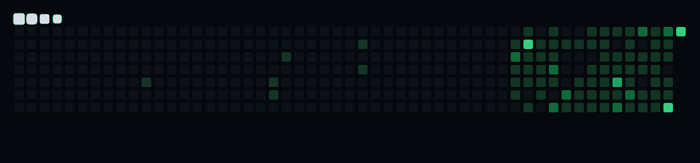

## 06 / GITHUB ACTIVITY

LIVE GITHUB CONTRIBUTIONS • UPDATED DAILY

---

---

<!-- PROJECTS + LANGUAGE STACK -->

---

---

---

---

---

---

`DATA → INSIGHT → DECISION`

**Turning complex data into clear business decisions.**

### Let's Connect

&nbsp;

  

`DATA → INSIGHT → DECISION`

**Turning complex data into clear business decisions.**

 

Open a link above to connect with me.

